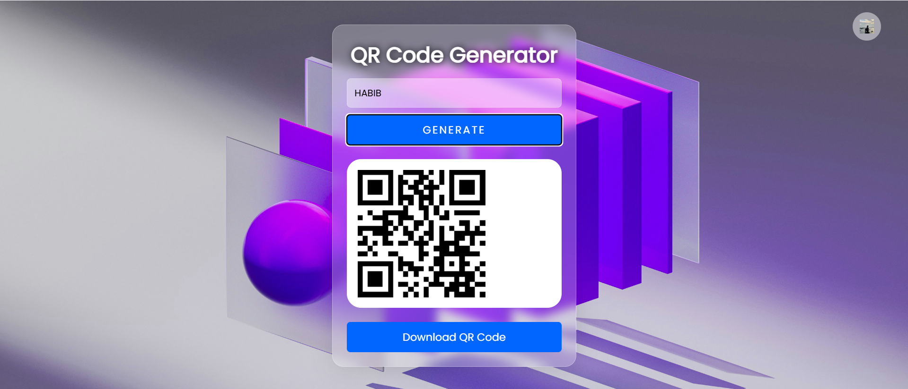
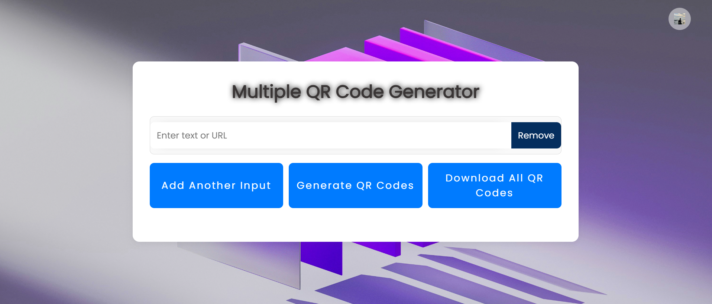
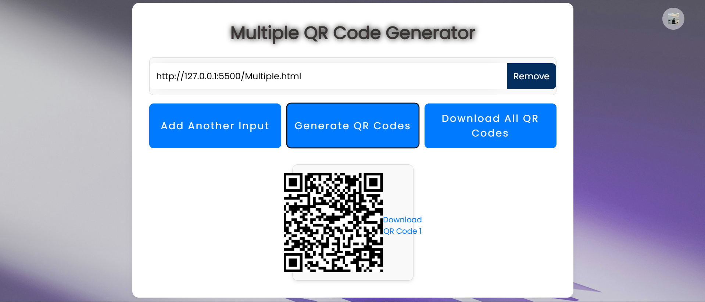
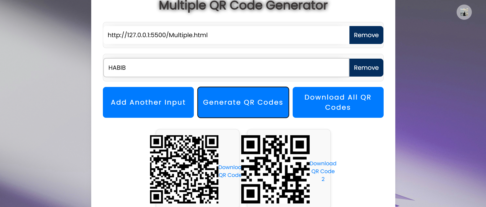

# 🧾  QR Code Generator

A responsive and user-friendly web app to generate **multiple QR Codes** from text or URLs. Easily add or remove inputs and download the QR codes individually or all at once.


## 🔗 Live Demo
👉 [Try it now](https://fikr-habib.github.io/qr-code/) 


## ✨ Features
- Generate multiple QR codes at once
- Add or remove input fields
- Download each QR code individually
- Download all QR codes with one click
- Clean and responsive UI
- Built with HTML, CSS, JavaScript

## 📸 Screenshots







## 🛠️ Built With
- HTML5  
- CSS3  
- JavaScript (Vanilla)  
- [QRCode.js](https://davidshimjs.github.io/qrcodejs/)  
- [Tippy.js](https://atomiks.github.io/tippyjs/)

## 🚀 Getting Starte
### Run Locally

```bash
git clone https://github.com/Fikr-Habib/multiple-qr-code-generator.git
cd multiple-qr-code-generator
start index.html


###  🤝 Contributing
আপনি যদি এই প্রজেক্টটিতে নতুন ফিচার যুক্ত করতে চান, বাগ ফিক্স করতে চান, অথবা উন্নত কোডিং স্টাইল নিয়ে আসতে চান — আপনি একেবারেই স্বাগতম! 😊
আমি কৃতজ্ঞ থাকবো আপনার অবদানের জন্য।

### 🪜 How to Contribute:
1. Fork this repository
2. Clone your fork:

bash
git clone https://github.com/your-username/qr-code-generator.git

3. Create a branch:
git checkout -b feature/your-feature-name

4. Make changes, commit and push:

bash
git add .
git commit -m "Add: your feature"
git push origin feature/your-feature-name

5. Open a Pull Request
### ✅ Guidelines
. Keep code clean & readable
. Add meaningful commit messages
. Mention your changes clearly in PR description
. Don't forget to update README if needed

##  📄 License
This project is licensed under the MIT License

👨‍💻 Author
MD.HabibIR RAHMAN

**🔗 GitHub - Fikr-Habib**
Built with ❤️ to help everyone use QR Codes more easily and efficiently.
